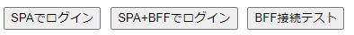
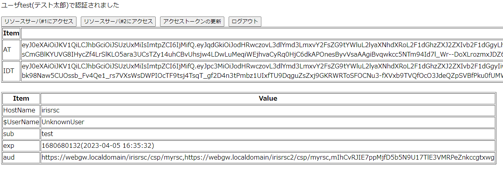
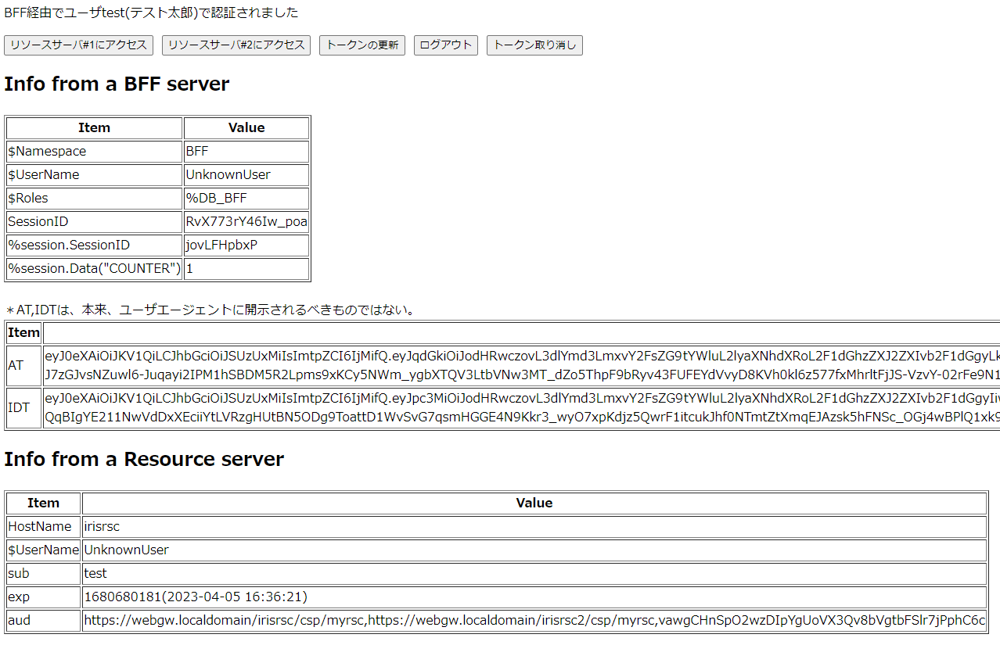

# クライアントアプリケーション編
「[IRISだけでoAuth2/OpenID ConnectのSSO/SLO環境を実現する/サーバ編](https://jp.community.intersystems.com/node/539046)」
のクライアントアプリケーション編です。サーバ編の構成が既に稼働していることを前提にしています。

<span style="color: red; ">既にサーバ編でgit clone実行された方(ありがとうございます)、若干の変更がありますのでgit pullと./build.shの実行をお願いします。</span>

oAuth2クライアントアプリケーション(OICD用語ではRP。以下RPと称します)の形態として、5種類用意しています。

---------

|形態|ライブラリ|登録クライアントタイプ|SSO|SLO|
|:--|:--|:--|:--|:--|
|Webアプリケーション|IRIS/CSP|Confidential|実装あり|実装あり|
|SPA |Angular|Public|実装あり|実装なし|
|SPA+BFF |Angular,IRIS/REST|Confidential|実装あり|実装あり|
|Python |oauthlib|Confidential|N/A|N/A|
|curl|N/A|Confidential|N/A|N/A|

---------

> PythonやcurlがConfidential(client_secretの秘匿性を十分に保てる)か、というと微妙ですが、あくまで利用者は開発者のみ、という位置づけです。

<!--break-->

## Webアプリケーション(非SPA)  
従来型のWebアプリケーション、Confidential Clientの例です。

```text
                      login/logout
      +-----------------------------------------------------+
      |                                                     | 
ブラウザ ---Apache--> CSPベースのWebアプリケーション +--> 認可サーバ
(ユーザセッション,   (CSP SessionID,AT等)            |    (ユーザセッション)
CSP sessionID)                                       +--> リソースサーバ
```

IRISに限りませんが、SSOで得たユーザ情報(subクレーム)を、RPやリソースサーバで使用するユーザにどのようにマッピングするか設計・実装する必要があります。ここではRPの実装例として、下記の2種類を用意しています。

- IRISのユーザ認証をしない

  IRISユーザとの認証(マッピング)は一切行わず、RPのアプリケーションコード内で取得したoAuth2/OIDC関連の情報のみでアクセス制御する形式です。  
  サーバ編で使用した[Webアプリケーション#1a](https://webgw.localdomain/irisclient/csp/user/MyApp.Login.cls),[1b](https://webgw.localdomain/irisclient/csp/user2/MyApp.Login.cls)がこれに該当します。  

  内容としては、[この記事](https://jp.community.intersystems.com/node/478821)でGoogleをOPとした例を元に、IRISをOPに変更したものです。  
  RPの一部として、認可コードフローの開始を行っています。

  > この例ではRP上はIRISユーザ、UnknowUser(RoleはWebアプリケーションで付与)で動作します。

- ログインフォームをカスタマイズして、IRISユーザとマッピングする

  IRISのログインページのカスタマイズ機能と代行ログインの仕組みを利用して、oAuth2/OIDC関連の情報取得とRPで使用するIRISユーザとの認証(マッピング)を行います。  
  RP実行ユーザはSSOログインに使用したユーザ名に"OAuth"を付与した名称を持つ代行ユーザになります。

  > 例えば、testというユーザでSSOした場合、RP上のIRISユーザ名はAuth2test(RoleはZAUTHENTICATEで付与)になります

  [Webアプリケーション#2](https://webgw.localdomain/irisclient2/csp/user/MyApp.AppMain.cls)がこれに該当します。  

  RPは、認証が完了した状態からの開始になります。上記のLogin.clsが担っていた役割は、[カスタムログインページ](https://github.com/IRISMeister/iris-oauth2/blob/main/irisclient2/src/MyApp/OAuth2Login.cls)と[ZAUTHENITICATE](https://github.com/IRISMeister/iris-oauth2/blob/main/irisclient2/src/%25SYS/ZAUTHENTICATE.mac)に隠ぺいされます。

  > 現時点で、こちらの方法はあまり深堀りしていません。もう少し製品サイドの機能拡充を待ちたいと思います...。
  
## SPA  
Angularで動作する、Public Clientの例です。

```text
                      login/logout
      +-----------------------------------------+
      |                                         | 
ブラウザ(SPA) -----Apache--+--> Webpack         |
(ユーザセッション)         +-------------> 認可サーバ
                           |               (ユーザセッション)           
                           +-------------> リソースサーバ
```

ng(AngularのCLI)でビルドを行い、ビルド成果物(webpack)をapacheに配布します。
SPAが直接アクセストークンを入手、使用しますので、セキュアな環境が必要な場合、その漏洩対策が必要とされています。

> その対策が大変なので、BFFという仕組みが提案されています

現状、SLOは機能しません。正確には、認可サーバからのログアウトは実行されます(その結果、同じユーザセッションに属するトークンは破棄されます)が、SPAベースの各RPに対して、SLOされたというイベントを安全に伝える方法が無いため、各ブラウザタブのsessionStorageに保存されているアクセストークンの破棄などを行うRP側のlogout処理をトリガ出来ないためです。
> トークンがExpire(デフォルトで3,600秒)すればRP自身で気づくきっかけになります

RPが定期的にuserinfo等を取得して、ユーザセッションが有効か確認するという方法はあり得ますが、認可サーバへのストレスが大きいです。

SLO実行後、認可サーバ上のユーザセッションは終了していますので、その後のRPでのトークンの更新やログアウト,リソースサーバでのGetIntrospectionは失敗します。

OpenID Connect Session Management 1.0の[Session Status Change Notification](https://openid.net/specs/openid-connect-session-1_0.html#ChangeNotification)がこの仕組みに関する仕様です。  
RPの画面にRP用、OP用のiframeをhiddenで用意しておいて、その両者(クロスドメインの可能性あり)でデータ交換することで、ログアウトされた(セッションのステータスが変更した)ことを知る...みたいな内容です。
IRISはOpenID Connect Session Management 1.0を[サポート](https://docs.intersystems.com/irislatest/csp/docbook/DocBook.UI.Page.cls?KEY=GOAUTH_intro#GOAUTH_intro_standards)していません。

> IRISが対応しているのは[front channel logout](https://openid.net/specs/openid-connect-frontchannel-1_0.html)です。

もし深堀りされたいなら、[こちら](https://manfredsteyer.github.io/angular-oauth2-oidc/docs/additional-documentation/session-checks.html)などが参考になりそうです。

## SPA+BFF  
Angularに[BFF(Backend For Frontend)](https://datatracker.ietf.org/doc/html/draft-ietf-oauth-browser-based-apps#section-6.2)を追加することで、Confidential Client化する例です。

```text
                      login/logout
      +-----------------------------------------------------+
      |                                                     | 
ブラウザ(SPA) -----Apache--+--> Webpack                     |
(ユーザセッション,         +--> REST ------------+----> 認可サーバ
sessionID)                      (sessionID,AT等) |      (ユーザセッション)
                                                 +--> リソースサーバ
```

BFFについては、[こちら](https://dev.to/damikun/web-app-security-understanding-the-meaning-of-the-bff-pattern-i85)の説明がわかりやすかったです。

> ざっくりと言ってしまえば、SPA単独と比べてよりセキュアで、RPの種類が増えた際にアーキテクチャ上のメリットがある、ということです。

本BFF実装は、下記のIRISのRESTエンドポイント(そこで使用されるRP用のAPI)をAngularから呼び出す事で実現しています。  

Angular側の大半の処理は[bff.service.ts](https://github.com/IRISMeister/angular-oauth2-client/blob/main/src/app/service/bff.service.ts)にあります。IRISのRESTエンドポイントは[BFF.REST.cls](https://github.com/IRISMeister/iris-oauth2/blob/main/irisclient/src/BFF/REST.cls)で実装されています。

---------

|Angular|IRIS|実行されるAPI|
|:--|:--|:--|
|接続、ログイン|/getauthurl|##class(%SYS.OAuth2.Authorization).GetAuthorizationCodeEndpoint()|
|userinfo取得|/userinfo|##class(%SYS.OAuth2.AccessToken).GetUserinfo()|
|リソースサーバアクセス|/call|通常のhttpリクエスト+アクセストークン|
|トークン更新|/refresh|##class(%ZSYS.OAuth2.Authorization).GetAccessTokenRefreshById() *1|
|ログアウト|/getauthurl|##class(%ZSYS.OAuth2.Authorization).GetLogoutEndpoint() *2|
|トークン破棄|/revocation|##class(%SYS.OAuth2.AccessToken).RevokeToken()|

---------
(*1)トークン更新は独自にメソッドを実装しています。  
(*2)現在、独自メソッドを実装していますが、V2023.2以降で標準APIに反映される予定です。

ユーザエージェント-BFF間のセッション維持のために、##class(BFF.REST).GetAuthorizationCodeEndpoint()で、サーバ側で独自にsessionID(httponlyクッキー)発行しています。セッションIDの生成ロジックはセキュリティ強度に直結しますので、適宜見直してください。

```ObjectScript
Set sessionid=##class(%OAuth2.Utils).Base64UrlEncode($system.Encryption.GenCryptRand(12))  // 要変更
  ・
  ・
Do %response.SetCookie(..#SESSIONCOOKIE,sessionid,,..#COOKIEPATH,,..#SECURECOOKIE,1) ; secure,httponly 
```

## Python  
これはアプリケーションとは呼べないです。  
認可コードフローを利用する、デバッグ、実験用途のpythonクライアントです。Confidential Clientとして登録しています。 ブラウザで実行すると、リダイレクトの連鎖の中で見落としてしまう内容を捕捉するために使用しました。

```text
python +--> ブラウザ -----Apache--------> 認可サーバ
       |    (ユーザセッション)     (ユーザセッション)
       +---Apache---> リソースサーバ
```

## curl  
これはアプリケーションとは呼べないです。  
これも、サーバの動作確認のためのデバッグ用途です。Confidential Clientとしています。
リソースオーナー・パスワード・クレデンシャルズのクライアントとして使用します。これもデバッグ、実験用途なので、受信したトークンの有効性チェック等は一切行っていません。

> リソースオーナー・パスワード・クレデンシャルズの使用は[禁止される](https://datatracker.ietf.org/doc/id/draft-ietf-oauth-security-topics-16.html#name-resource-owner-password-cre)ようです。

```text
curl --Apache--+--> 認可サーバ
               +--> リソースサーバ
```

# クライアント認証メソッドの設定

認可サーバへのRP登録時に、RPがトークンエンドポイントにアクセスする際の[クライアント認証メソッド](https://openid.net/specs/openid-connect-core-1_0.html#ClientAuthentication)を指定します。

SPAだけは「エンコードされたボディから(client_secret_post)」を選択しています。残りは全て「ベーシック(client_secret_basic)」になっています。

下記は、[MyApps.Installer.cls](https://github.com/IRISMeister/iris-oauth2/blob/main/irisauth/src/MyApps/Installer.cls)からの抜粋。
```objectscript
Set c.Metadata."token_endpoint_auth_method" = "client_secret_basic"
```

>「エンコードされたボディから」はPOSTリクエストのBodyにパラメータとして渡す形式、「ベーシック」は、HTTPヘッダでAuthorization: Basic BASE64(client_id:client_secret)を指定する形式です。

# IRISに用意されているRP用のAPI群

IRISベースのRP(CSPベースのWebアプリケーション、SPA+BFFのBFFサーバ)の場合、RP用に用意された以下のAPI群を使用できます。

詳細は、[ドキュメント](https://docs.intersystems.com/irislatestj/csp/docbook/Doc.View.cls?KEY=GOAUTH_client)を参照ください。

## ログイン時

\#\#class(%SYS.OAuth2.Authorization).GetAuthorizationCodeEndpoint()は、認可サーバへのログインを実行するためのURLを返却します。ユーザがこのURLをクリックすることで、認可コードフローが開始します。

使用例は[MyApp.Login.cls](https://github.com/IRISMeister/iris-oauth2/blob/main/irisclient/src/MyApp/Login.cls)を参照ください。

```objectscript
set url=##class(%SYS.OAuth2.Authorization).GetAuthorizationCodeEndpoint(
  $$$APP,
  scope,
  "https://webgw.localdomain/irisclient/csp/"_ns_"/MyApp.AppMain.cls",
  .properties,
  .isAuthorized,
  .sc)
```

\$$$APPはRPを認可サーバに登録した際に使用した登録名(USER_CLIENT_APP等)です。scopeには認可を要求するスコープ("openid profile scope1"等)を指定します。

返却されるURLは次のような内容になります。いわゆる[承認リクエスト](https://tex2e.github.io/rfc-translater/html/rfc6749.html#4-1-1--Authorization-Request)です。
```
https://webgw.localdomain/irisauth/authserver/oauth2/authorize
  ?response_type=code
  &client_id=01yJ2zW0K9XQqrroIB4b7PLci3NkJBegm0b_kBcFhgw
  &redirect_uri=https%3A//webgw.localdomain/irisclient/csp/sys/oauth2/OAuth2.Response.cls
  &scope=openid%20profile%20scope1
  &state=gWr5ipHAtskDhf0fFbNtxxJWnwY
  &nonce=paEDbHweG2xiJxWxotTfaJPbdB4
  &code_challenge=8X5l4fxCNOdLj-u87Mu3UwRH96dxYpjoGcv6Z-JZmEc
  &code_challenge_method=S256
```

RPのリダイレクト先を指定するredirectクエリパラメータ値がOAuth2.Response.clsになっていますが、これはIRISベースのRP専用のランディングページになっていて、RPがするべきこと(認可コードの取得、stateのチェック、アクセストークンリクエストの発行、などなど)を行ってくれます。

RPの登録内容(クライアントのリダイレクトURL)も、下記のようにホスト名、ポート番号、プレフィックスのみを指定すれば、このリダイレクト先が自動選択されます。


CSP(非REST)ベースのアプリケーションは、CSPセッションという独自のセッションID(%session.SessionId)と保存領域を作成します。oAuth2クライアントとして一度認証・認可を受けると、認証関連の情報(アクセストークン,有効期限など)を、このCSPセッションIDを主キーとしたテーブルに保存します(さきほどのOAuth2.Response.clsが実行)。

```bash
$ docker compose exec irisclient iris session iris -U%SYS "##class(%SYSTEM.SQL).Shell()"
[SQL]%SYS>>select ApplicationName,SessionId,Expires,ResponseType,Scope,CONVERT(VARCHAR(10),AccessToken) from OAuth2.AccessToken

ApplicationName SessionId       Expires ResponseType    Scope   Expression_6
CLIENT_APP      S1YXEXP9SP      1677551976      code    openid profile scope1 scope2 scope99    eyJ0eXAiOi
```

一方、ブラウザにはCSPセッションID(を拡張したデータ)のみがセッションクッキー(HttpOnly, デフォルト設定ではSameSite=Strict)で保存されます。  
> この辺りは従来のCSPのメカニズムそのものです。例えば CSPSESSIONID-SP-443-UP-irisclient-csp-user- というクッキー名になります。

認可コードフローの終了時には、GetAuthorizationCodeEndpoint()の第3引数で指定したURL、この場合は[MyApp.AppMain.cls](https://github.com/IRISMeister/iris-oauth2/blob/main/irisclient/src/MyApp/AppMain.cls)にリダイレクトされます。


## 認証済みか否かの確認

\#\#class(%SYS.OAuth2.AccessToken).IsAuthorized()はRPが認証済みかどうかを確認するAPIです。  

> 認可コードフローのリダイレクト先であるOAuth2.Response.clsはRPが認証済みかどうかを確認するための情報元をRPに格納します

2つの事を行ってくれます。  

- その情報の状態によってRPが既に認証済みかどうかの確認を行います

- 認証済みである場合、アクセストークン、IDトークンなどを返却します

[MyApp.Login.cls](https://github.com/IRISMeister/iris-oauth2/blob/main/irisclient/src/MyApp/Login.cls)のOnPreHTTP()や、[MyApp.AppMain.cls](https://github.com/IRISMeister/iris-oauth2/blob/main/irisclient/src/MyApp/AppMain.cls)で使用されています。

RPが既に認証済みの場合は、[MyApp.Login.cls](https://github.com/IRISMeister/iris-oauth2/blob/main/irisclient/src/MyApp/Login.cls)のOnPreHTTP()が実行され、IsAuthorized()がTrueとなり、認可サーバを経由することなく、[MyApp.AppMain.cls](https://github.com/IRISMeister/iris-oauth2/blob/main/irisclient/src/MyApp/AppMain.cls)にリダイレクトされます。

```objectscript
ClassMethod OnPreHTTP() As %Boolean [ ServerOnly = 1 ]
{
  #dim %response as %CSP.Response
  set scope="openid profile "_..#SCOPES
  if ##class(%SYS.OAuth2.AccessToken).IsAuthorized($$$APP,,scope,.accessToken,.idtoken,.responseProperties,.error) {
    set %response.Redirect="MyApp.AppMain.cls"
  }
  Return $$$OK
}
```

## IDトークンの有効性の確認(Validation)

\#\#class(%SYS.OAuth2.Validation).ValidateIDToken()はIDトークンの有効性を確認します。

どのような確認を行うかは、[OIDC](https://openid.net/specs/openid-connect-core-1_0.html#IDTokenValidation)
で定められています。

[MyApp.AppMain.cls](https://github.com/IRISMeister/iris-oauth2/blob/main/irisclient/src/MyApp/AppMain.cls)で使用されています。

```objectscript
set valid=##class(%SYS.OAuth2.Validation).ValidateIDToken(
    $$$APP,
    idtoken,
    accessToken,
    ..#SCOPES,
    ..#RSCURL1,  // RSCURL2の存在チェックはしていないので注意
    .jsonObject,
    .securityParameters,
    .sc)
```

トークンの受信後には署名の有無の確認を行います。
```objectscript
        Set isSigned=$Data(securityParameters("sigalg"))#2
        if 'isSigned="" { 
            write "署名されていません !<br>",!
        }
```

## Introspection

\#\#class(%SYS.OAuth2.AccessToken).GetIntrospection()は認可サーバにアクセストークンの有効性を問い合わせます。

> 認可サーバへのトラフィックが発生するため、opaqueのアクセストークンの場合は必須ですが、JWTの場合は任意とされています

[MyApp.AppMain.cls](https://github.com/IRISMeister/iris-oauth2/blob/main/irisclient/src/MyApp/AppMain.cls)で使用されています。

```objectscript
set sc=##class(%SYS.OAuth2.AccessToken).GetIntrospection($$$APP,accessToken,.jsonObject)
```
## ログアウト時

\#\#class(%SYS.OAuth2.Authorization).GetLogoutEndpoint()は、SLO(シングルログアウト)を実行するためのURLを返却します。ユーザがこのURLをクリックすることで、RP Initiatedのフロントチャネルログアウトが開始します。

```objectscript
Set ns=$ZCVT($NAMESPACE,"L") Set fclouri="https://webgw.localdomain/irisclient/csp/"_ns_"/MyApp.Login.cls"
Set url=##class(%SYS.OAuth2.Authorization).GetLogoutEndpoint($$$APP,fclouri)
```

返却されるURLは次のような内容になります。
```
https://webgw.localdomain/irisclient/csp/sys/oauth2/OAuth2.PostLogoutRedirect.cls
  ?register=irzgE0VENqa51QpmvGcmG-nDWn0
```

このURLをGETすると、さらに認可サーバのlogoutエンドポイントへのURLにリダイレクトされます。[RP-Initiated Logout](https://openid.net/specs/openid-connect-rpinitiated-1_0.html#RPLogout)のためのエンドポイントです。

```
 https://webgw.localdomain/irisauth/authserver/oauth2/logout
  ?id_token_hint=eyJ0eXAiO.....
  &post_logout_redirect_uri=https://webgw.localdomain/irisclient/csp/sys/oauth2/OAuth2.PostLogoutRedirect.cls
  &state=Pc73yDQFouYO1Y-a0PioOI3qRtw
```

RPのリダイレクト先を指定するpost_logout_redirect_uriクエリパラメータ値がOAuth2.PostLogoutRedirect.clsになっていますが、これはIRISベースのRP専用のランディングページになっていて、RPがするべきこと(RPに保存されているトークンの除去等)を行ってくれます。

ログアウト終了時には、GetLogoutEndpoint()の第2引数で指定したURL(この場合は、ログインページであるMyApp.Login.cls)にリダイレクトされます。

## トークンの失効処理(Revocation)

\#\#class(%SYS.OAuth2.AccessToken).RevokeToken()は指定したトークンを失効させます。

ユーザセッション使用時に、単独のアクセストークンのみを失効させることで、特定のアプリケーション単独のログアウトを実現します。ログイン時はSSOのメリットを受けつつ、ログアウトは個別に行いたい場合に使用できます。

CSPベースのWebアプリケーションの場合、ログアウト時にはCSPセッションを終了させますが、本メソッドの呼び出しは、CSPセッションの終了時に自動実行されるため、アプリケーションコードで明示的に呼び出す必要はありません。RESTを使用する場合、(USESESSIONパラメータを1にしない限り)CSPセッションは使用しませんので、明示的に呼び出す必要があります。

本例では、[MyApp.AppMain.cls](https://github.com/IRISMeister/iris-oauth2/blob/main/irisclient/src/MyApp/AppMain.cls)のOnPreHTTP()で下記を実行しています。

```objectscript
Do %session.Logout() 
Set %session.EndSession=1 ; will call OAuth2.SessionEvents.OnEndSession()
Set %response.Redirect="MyApp.Login.cls"
```

## リソースサーバへのRESTアクセス

リソースサーバのRESTエンドポイント呼び出し時は、##class(%SYS.OAuth2.AccessToken).AddAccessToken()を使用してアクセストークンを追加します。追加方法は第2引数で指定します。省略時はHTTPヘッダーに"Authorization: Bearer"を追加します。

```objectscript
set httpRequest=##class(%Net.HttpRequest).%New()
// AddAccessToken adds the current access token to the request.
set sc=##class(%SYS.OAuth2.AccessToken).AddAccessToken(
    httpRequest,,
    ..#SSLCONFIG,
    $$$APP)
if $$$ISOK(sc) {
    Set url=..#RSCURL2_"/private" w "URL:"_url_"</BR>",!
    set sc=httpRequest.Get(url)
}
```

# 導入手順
複数のgitをcloneしますが、下記のフォルダ構造にしておけば、各種手順やシェルを修正することなく(最もストレスなく...)動作させる事が出来ます。

```
Linux
(任意)/iris-oauth             <= サーバ編で導入済みのはず
(任意)/angular-oauth2-client  <= git clone https://github.com/IRISMeister/angular-oauth2-client.git

Windows
C:\git\python-oauth2-client   <= git clone https://github.com/IRISMeister/python-oauth2-client.git
C:\git\angular-oauth2-client  <= ngビルドをWindowsで動かすのであれば
```
以下、(任意)は$HOME/gitとしています。

## Webアプリケーション
### 導入手順
不要です。サーバに同梱されています。

### 起動方法
こちらはIRISサーバで完結するので、単独の起動方法はありません。サーバ用のコンテナ起動時に自動起動します。

### アクセス方法

---------

|名称|エンドポイント|
|:--|:--|
|WebApp 1a|[/irisclient/csp/user/MyApp.Login.cls](https://webgw.localdomain/irisclient/csp/user/MyApp.Login.cls)|
|WebApp 1b|[/irisclient/csp/user2/MyApp.Login.cls](https://webgw.localdomain/irisclient/csp/user2/MyApp.Login.cls)|
|WebApp 2|[/irisclient2/csp/user/MyApp.AppMain.cls](https://webgw.localdomain/irisclient2/csp/user/MyApp.AppMain.cls)|

---------

操作については、サーバ編を参照ください。

## SPA(Angular)

F5(リロード)対策としてアクセストークンをsessionStorageに保存しています。XSS脆弱性に対してご注意ください。  

### 導入手順

LinuxあるいはWindowsで実行します。  
ビルド・実行にはnode, npm, ngが必要です。私の環境は以下の通りです。Windowsでも同じことが出来ます。

> Windowsの場合、./build_and_deploy.ps1, ng-start.ps1内の$env:gitrootの値を環境にあわせて修正してください。
```
$ ng version

Angular CLI: 15.1.6
Node: 16.16.0
Package Manager: npm 9.3.0
OS: linux x64

Angular: 15.1.5
... animations, common, compiler, compiler-cli, core, forms
... platform-browser, platform-browser-dynamic, router

Package                         Version
---------------------------------------------------------
@angular-devkit/architect       0.1501.6
@angular-devkit/build-angular   15.1.6
@angular-devkit/core            15.1.6
@angular-devkit/schematics      15.1.6
@angular/cli                    15.1.6
@schematics/angular             15.1.6
rxjs                            7.8.0
typescript                      4.9.5

```
下記の手順でビルドしたangularアプリケーションのディストリビューション(./dist/*)を、iris-oauth2のhtdocs/下にコピーすることで使用可能になります。

1. Git Clone

    カレントディレクトリが./iris-oauth2であることを確認してください。その1階層上のディレクトリに移動して、cloneします。
    ```bash
    $ pwd
    /home/irismeister/git/iris-oauth2
    $ cd ..
    $ git clone https://github.com/IRISMeister/angular-oauth2-client.git
    $ cd angular-oauth2-client
    ```
2. 
    ```bash
    $ npm install
    $ ./build_and_deploy.sh   (Windowsの場合は>powershell ./build_and_deploy.ps1)
    ```
    このシェルは下記を行います。
    - client_id, client_secretをサーバ配下のファイル(environment*.ts)から取得  
    - NGビルド実行。 ターゲットは/myapp/  
    - htdocs/myapp/以下にビルド成果物をコピー  
    - NGビルド実行。 ターゲットは/myapp2/  
    - htdocs/myapp2/以下にビルド成果物をコピー  

    下記のように表示されれば成功です。
    ```bash
    $ ./build_and_deploy.sh
    ✔ Browser application bundle generation complete.
    ✔ Copying assets complete.
    ✔ Index html generation complete.
          ・
          ・
          ・
    Build at: 2023-04-05T07:23:58.705Z - Hash: 67aabdbbe8ad0bfa - Time: 6796ms
    deploying to iris-oauth2
    done
    Go to https://webgw.localdomain/myapp/ or https://webgw.localdomain/myapp2/
    $
    ```


以後、iris-oauth2をリビルドするなどで、client_id,client_secretが変更された場合は、build_and_deploy.shを再実行してください。

### 起動方法

こちらはApacheを使用しますので単独の起動方法はありません。サーバ用のコンテナ起動時に自動起動します。

### アクセス方法

---------

|名称|エンドポイント|
|:--|:--|
|SPAアプリケーション|[/myapp](https://webgw.localdomain/myapp/)|
|SPAアプリケーション|[/myapp2](https://webgw.localdomain/myapp2/)|

---------

両者は、client_idが異なる(つまり別のRPとみなす)だけ内容は同じです。下記のような「最高にクール」な画面が表示されます。



「BFF接続テスト」を押すとBFFとの疎通確認を行い、成功の場合IRISバージョンを画面表示します。

「SPAでログイン」を押すと、SPAのみで認証を行います。下記のような画面が表示されれば成功です。適当にボタンを押して(処理内容はボタンが示す通りです)動作確認してください。  


### 修正・デバッグ

修正・デバッグ目的で、Angular Live Development Serverで起動することができます。
```
./ng-start.sh (Windowsの場合は>powershell ./ng-start.ps1)
```

Compiled successfullyという起動メッセージが表示されたら、[Angularアプリケーション(live)](http://webgw.localdomain:4200/myapp)にアクセスします。

### よくあるエラー
Unexpected request - client_idと表示される場合、(恐らく)client_idが正しく反映されていません。build_and_deploy.shで直ります。

### 今後の修正
今後のドキュメントへの加筆・修正等は[こちら](https://github.com/IRISMeister/angular-oauth2-client)で行います。


## SPA(Angular)+REST+BFF

Webアプリケーションではセッション管理にCSPセッションを使用していますが、SPA+BFFでは独自のセッションを作成しています。  
> sessionidというクッキー名です。

SLOが機能します。

### 導入手順
SPA(Angular)に同梱されています。
### 起動方法
SPA(Angular)と同時に起動されます。

### アクセス方法
SPA(Angular)と同じです。

「SPA+BFFでログイン」を押すと、SPA+BFFで認証を行います。下記のような画面が表示されれば成功です。SPAとほぼ同じですが、こちらにはBFFサーバの情報表示とトークンの取り消し機能が追加されています。    


## Python
### 導入手順
ブラウザをポップアップさせる必要があるため、Windowsで稼働させます。  
DOS窓から下記を実行します。
```dos
C:\git> git clone https://github.com/IRISMeister/python-oauth2-client.git
C:\git> cd python-oauth2-client
```

Linux上のssl/web/all.crt(Webサーバの証明書チェーン)をローカルのc:\tempにコピーしてください。 

```bash
$ pwd
/home/irismeister/git/iris-oauth2
$ cp ssl/web/all.crt /mnt/c/temp
```

クライアント情報を起動時に出力された内容(client/credentials_python.json)で上書きコピー(無ければ新規作成)します。  
コピー先は、cloneを実行したパスに合わせてください。

```bash
$ cp client/credentials_python.json /mnt/c/git/python-oauth2-client/credentials.json
```
### アクセス方法

pythonコードを起動します。
```dos
C:\git\python-oauth2-client>run.bat
```

ブラウザ上に、認証画面が表示されますので、「引き受ける」を押します。Please close the window.と表示されたら、ブラウザは以後不要なので閉じます。
DOS窓上にサーバから得た情報が出力されているはずです。

```
C:\git\python-oauth2-client>python request.py

***** auth_url *****
https://webgw.localdomain/irisauth/authserver/oauth2/authorize?response_type=code&client_id=EKj6Bww0yiFgeuYUxtkyzfge84-keMy20uE5xTmlWPk&redirect_uri=http%3A%2F%2Flocalhost%3A8080%2F&scope=openid+profile+scope1+scope2&state=aiq21soYtKWlzomgChYUlzVgjpby1v&code_challenge=AIu6-HIPnl1MKWIxImJ3Earg0ezfcUbNF75hLljXSmM&code_challenge_method=S256

***** headers *****
{'Content-Type': 'application/x-www-form-urlencoded'}

***** body *****

127.0.0.1 - - [05/Apr/2023 16:09:49] "GET /?code=N9Y2DT77QNd_d1mmnsSjwUiqbxOvDB3AfT9QM5mD6XFuYYByhtSD4AfIjjWGF6AFTwdhA8QyOjfX63RO1mYsvw&state=aiq21soYtKWlzomgChYUlzVgjpby1v HTTP/1.1" 200 -

***** decoded access token *****
{'alg': 'RS512', 'kid': '3', 'typ': 'JWT'}
{   'aud': [   'https://webgw.localdomain/irisrsc/csp/myrsc',
               'https://webgw.localdomain/irisrsc2/csp/myrsc',
               'EKj6Bww0yiFgeuYUxtkyzfge84-keMy20uE5xTmlWPk'],
               ・
               ・
               ・
```

ユーザセッション(CSPOAuth2Sessionクッキー)が有効になっているため、最後にログアウトを実行しています。新しいタブが開き、空白のページが表示されますので、閉じてください。

```python
  # Logout 
  logout_url='https://webgw.localdomain/irisauth/authserver/oauth2/logout?id_token_hint='+id_token+'&post_logout_redirect_uri=http://localhost:8080/fclogout&state='+state
  open_new(logout_url)
```

ここをコメントアウトすれば、次回以降の認証時にはログイン画面がスキップされます。

### よくあるエラー

```
urllib.error.URLError: <urlopen error [WinError 10061] 対象のコンピューターによって拒否されたため、接続できませんでした 。>
```
サーバ環境が起動していない、あるいは到達できない場合に発生します。

```
Unexpected request - client_id
```
ブラウザに上記の内容が表示される場合、credentials.jsonが正しくコピーされていません。  
このエラーが発生すると、DOSがControl-Cを受け付けない状態で止まってしまいます。その場合、ブラウザで別タブを開いて http://localhost:8080/ を開いてください(何も表示されません)。これでpythonコードが完了するはずです。

```
  File "F:\ISJ\WorkAtHome\git\python-oauth2\httpserverhandler.py", line 32, in get_access_token_from_url
    context.load_verify_locations(os.environ['REQUESTS_CA_BUNDLE'])
FileNotFoundError: [Errno 2] No such file or directory
```
証明書のチェーン(all.crt)がc:\temp\にコピーされていません。

### 今後の修正
今後のドキュメントへの加筆・修正等は[こちら](https://github.com/IRISMeister/python-oauth2-client)で行います。

## curl

### 導入手順
不要です。

本来Windowsで実行するべき内容ですが、サーバの修正時に使用することが大半なので、ここではLinuxで実行しています。そのため、Linuxの/etc/hostsにも下記を追加しています。
```
127.0.0.1       webgw.localdomain
```

認可サーバには以下の設定が行われています。

1. 認可サーバの構成で「リソース所有者のパスワード認証情報」がチェックされている

2. curlがクライアントとして登録されている
```
クライアントの種別:機密
リダイレクト URL:  http://localhost:8080/  (実際には使用されないので何でも良いです)
サポートする許可タイプ (少なくともひとつをチェック):「リソース所有者のパスワード認証情報」をチェック
サポートされている応答タイプ(少なくとも1つをチェックする): 「コード」をチェック
```

### 起動方法

下記は、[curl.sh](https://github.com/IRISMeister/iris-oauth2/blob/main/curl.sh)の実行結果です。

```bash
$ pwd
/home/irismeister/git/iris-oauth2
$ ./curl.sh

{
  "sub": "_SYSTEM"
}

{
  "HostName": "irisrsc",
  "UserName": "UnknownUser",
  "sub": "_SYSTEM",
  "aud": [
    "https://webgw.localdomain/irisrsc/csp/myrsc",
    "https://webgw.localdomain/irisrsc2/csp/myrsc",
    ""
  ],
  "sigalg": "RS512",
  "Status": "OK",
  "TimeStamp": "04/04/2023 17:25:57",
  "exp": "1680600357(2023-04-04 18:25:57)",
  "debug": {
    "jti": "https://webgw.localdomain/irisauth/authserver/oauth2.A20EIIXeenDpM6oK_At6ZEtCcKY",
    "iss": "https://webgw.localdomain/irisauth/authserver/oauth2",
    "sub": "_SYSTEM",
    "exp": 1680600357,
    "aud": [
      "https://webgw.localdomain/irisrsc/csp/myrsc",
      "https://webgw.localdomain/irisrsc2/csp/myrsc",
      ""
    ],
    "scope": "openid profile scope1 scope2",
    "iat": 1680596757,
    "customer_id": "RSC-00001"
  }
}
```

### その他の使い道

アクセストークンは[Bearerトークン](https://ja.wikipedia.org/wiki/Bearer%E3%83%88%E3%83%BC%E3%82%AF%E3%83%B3)なので、他の方法で取得したアクセストークンを使用してリソースサーバにアクセス出来ます。  
どのRPを使っても構わないのですが、下記のように実行すれば、正当なアクセスとみなされます。

```
access_token="eyJ0eXAiO.....BlohDZw" # 表示されたアクセストークンをコピペして環境変数に設定
curl --insecure -H "Authorization: Bearer ${access_token}" -H 'Content-Type:application/json;charset=utf-8' \
https://webgw.localdomain/irisrsc/csp/myrsc/private -s | jq
```

このURLはサーバ編でアクセスを拒否('NoAccessToken'エラー)させるために使用したものと同じです。

アクセストークンの秘匿性を保つことがいかに重要であるかを示す例ですが、開発時にはリソースサーバの簡単なデバッグツールとして使用できます。

