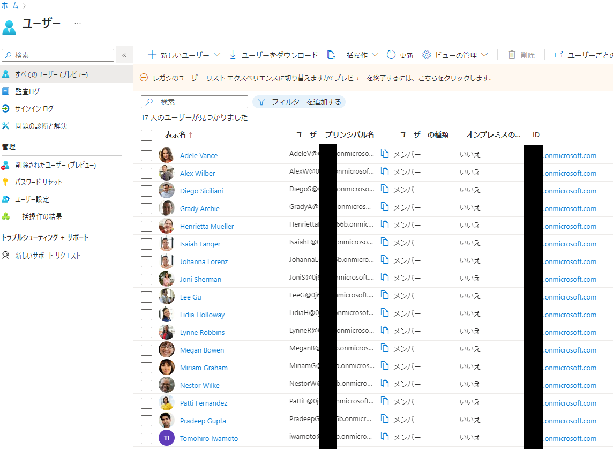
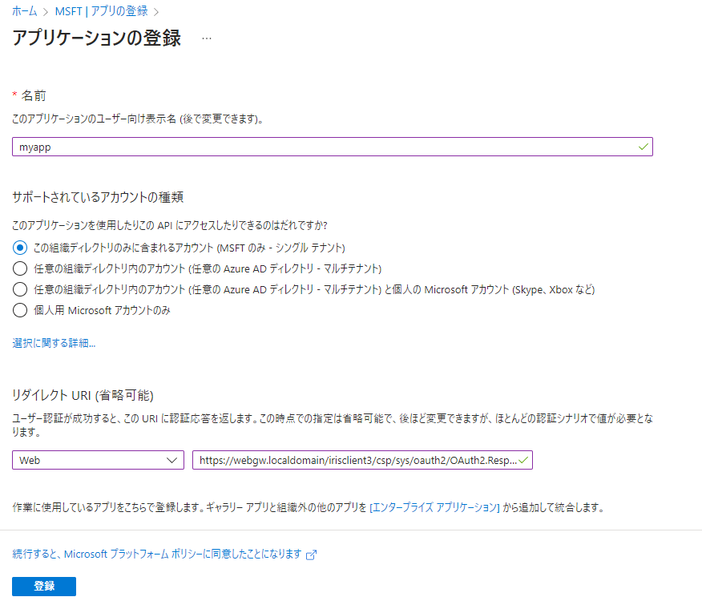
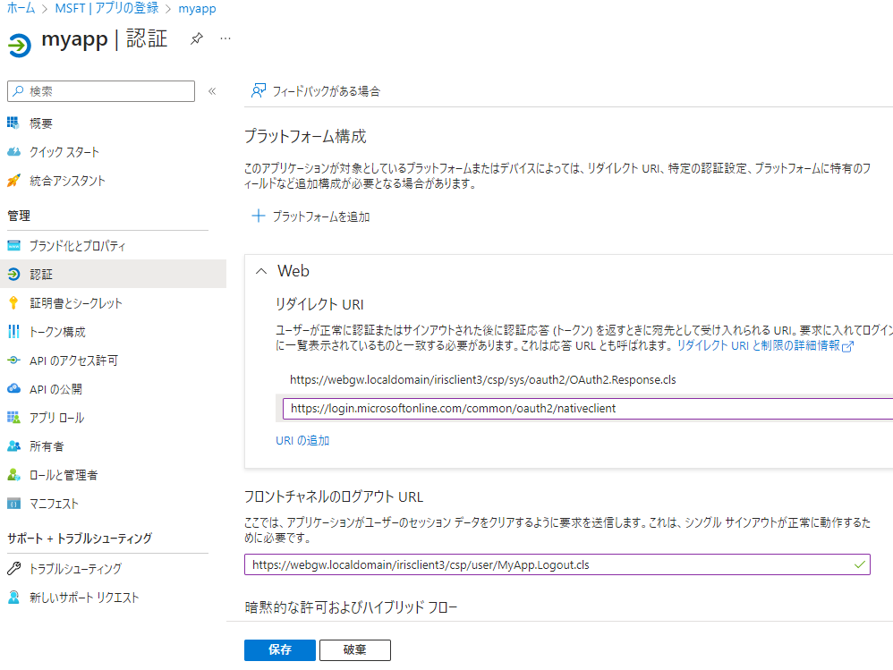
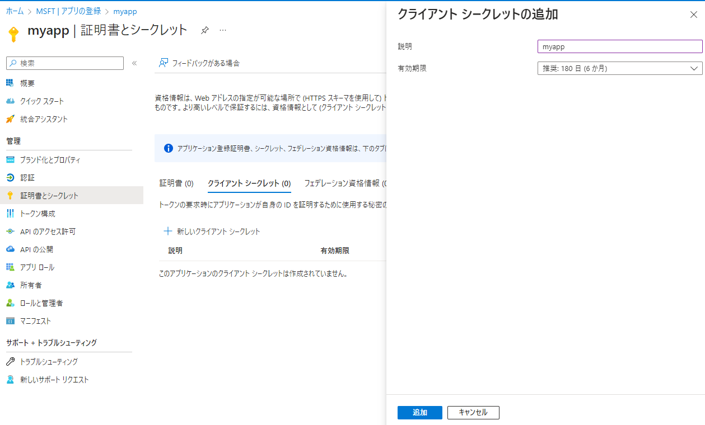
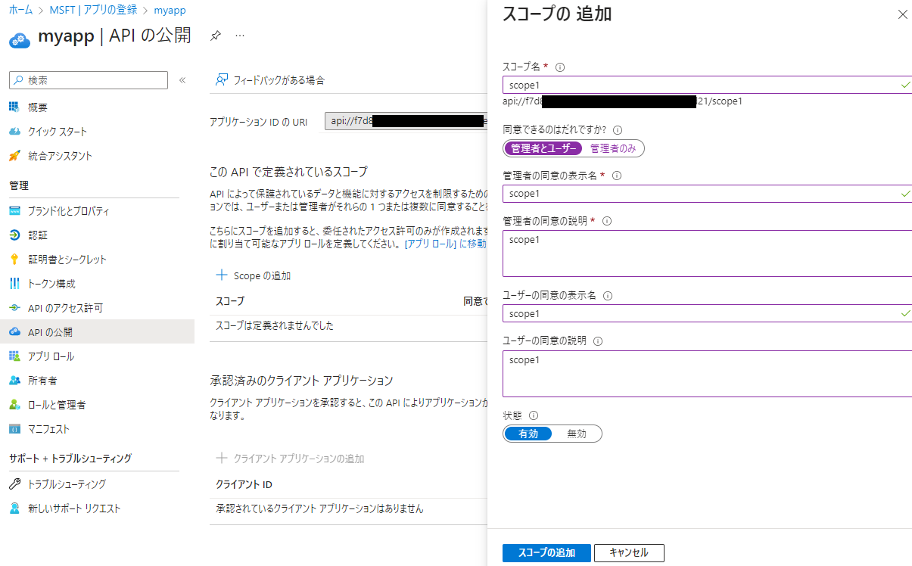

# Azure ADをOPとして利用する

# 相違点

元のタイトルから外れますがAzure ADをOPとした場合に、Wepアプリケーション(CSP)とSPA+BFF形式のRPにどのような修正が必要かを調べました。  
ある程度の差異は想定はしていましたが、思っていたより違うな、という印象を受けました。RP、リソースサーバ側でこれらの差異を吸収する必要がありました。

> 個人調べです。誤りがあるかもしれませんが、その際はご容赦ください。また、状況は刻々と変わる可能性があります。

- frontchannel_logout_session_supportedをサポートしていない

  オプショナルな機能ではありますが、これが、一番残念でした。
  sessionを使用したフロントチャネルログアウトを[サポートしていない](https://github.com/AzureAD/azure-activedirectory-identitymodel-extensions-for-dotnet/issues/474#issuecomment-271119891)ようです。実際、IDトークンに"sid"クレームが含まれていません。

  "http_logout_supported"はtrueなのでSLOは可能ですが、今回用意したクライアントでは実現していません。趣旨からそれますので、Azure使用時のSLOの実現は断念しました。ログアウト操作の対象は常に、ログアウトを実行したアプリケーション単独になります。

  > AD FSは[サポートしている](https://learn.microsoft.com/en-us/windows-server/identity/ad-fs/development/ad-fs-logout-openid-connect)と思われます。  

- "revocation_endpoint"をサポートしていない

  [OpenId Connectディスカバリー](docs/Azure/openid-configuration.json)に"revocation_endpoint"がありません(つまりサポートしていません)。

  そもそもSLOが無ければ、Revoke(アプリケーション単独でのログアウトに使用)を用意する意味はありませんので、これも断念しました。

- Userinfoのエンドポイントが独自

  IDトークンに同じ内容が含まれているので、それらを使うよう[推奨](https://learn.microsoft.com/ja-jp/azure/active-directory/develop/userinfo#consider-using-an-id-token-instead)されています。

  >ID トークンの情報は、UserInfo エンドポイントで入手できる情報のスーパーセットです。 UserInfo エンドポイントを呼び出すトークンを取得すると、同時に ID トークンを取得できます。このため、UserInfo エンドポイントを呼び出す代わりに、トークンからユーザーの情報を取得することをお勧めします。

  UserInfoエンドポイントも実際に試してみましたが、エラーが発生しました。このエンドポイントだけが	https://graph.microsoft.com/oidc/userinfo となっていることと関係あるのかもしれません。IDトークンから取得するよう変更しました。

- Introspectionをサポートしていない

  Introspectionは[未サポート](https://learn.microsoft.com/en-us/answers/questions/115061/does-azure-provide-any-oauth-2-token-introspection)のようです。実行しないように修正しました。

- アクセストークンのSCOPEパラメータ名が異なる

  SCOPEを示すパラメータ名がscpになっています。

  ```
    "scp": "scope1",
  ```

- 暗黙のSCOPE

  要求に明示的に"openid profile email offline_access"を含めても、トークンエンドポイントから取得したアクセストークンのSCOPEにはこれらを含まないようです。クライアントディスクリプション作成時に下記を指定することで対応可能です。

  ```
  Set c.AcceptNonStandardImplicitIdToken=1
  ```

- アクセストークン,IDトークンで同一クレーム名に異なる値が設定される

  "iss","aud"値がアクセストークン,IDトークンとで値が異なるため、クライアント側でのチェック対象を変える必要があります。

```
  アクセストークン
  {
    "aud": "api://xxx-xxx-xxx-xxx-xxx",
    "iss": "https://sts.windows.net/d8f44xxx-xxxx-xxxx-xxxx-xxxxxx2c5416/",
  }

  IDトークン
  {
    "aud": "xxx-xxx-xxx-xxx-xxx",
    "iss": "https://login.microsoftonline.com/d8f44xxx-xxxx-xxxx-xxxx-xxxxxx2c5416/v2.0",
  }
```

- "aud"の値を複数指定できない

  リソースサーバ側で"aud"をチェックする処理で「リソースサーバのURL」の有無をチェックしている処理が通らなくなります。"aud"にはクライアントアプリケーションのCLIENT_IDがセットされています。ひとまずこの値をチェックするように修正をしました。

- RefreshToken発行時のリクエストにSCOPE指定が必須

  Client_Secret指定時は、[Optional](https://learn.microsoft.com/en-us/azure/active-directory/develop/v2-oauth2-auth-code-flow#refresh-the-access-token)となっているscopeですが、指定しないと下記のエラーが出ました。[こちら](https://github.com/IdentityModel/oidc-client-js/issues/1264)の対応と同様にscopeを追加するために ##class(%ZSYS.OAuth2.Authorization).GetAccessTokenRefresh()を追加しました。

  ```
  AADSTS90009: Application 'xxx-xxx-xxx-xxx-xxx'(xxx-xxx-xxx-xxx-xxx) is requesting a token for itself. This scenario is supported only if resource is specified using the GUID based App Identifier. 
  ```

- OIDCのクライアント動的登録機能をサポートしていない

  OIDCのクライアント動的登録機能は[無い](https://github.com/AzureAD/microsoft-authentication-library-for-dotnet/issues/2404#issuecomment-906231388)ようです。

# 環境


[Microsoft 365開発者サブスクリプション](https://learn.microsoft.com/ja-jp/office/developer-program/microsoft-365-developer-program) を有効化して使用しました。

主な選択肢は下記のようにしました。
```
Set up a new Microsoft 365 developer sandboxを選択。
Instantを選択。
Country: AP
Admin: iwamoto
Password: xxxxxx
```

認証用にSMS用番号を求められるので入力。

これでiwamoto@xyz.onmicrosoft.comのようなアカウント名が付与されます。以後、このアカウントを使用して管理操作を行います。

>ほおっておくと、ログインできなくなるような警告が出ました。  
>「組織のセキュリティを維持するために、セキュリティの既定値群がオンになっています。Microsoft Authenticator アプリをセットアップして、2 段階認証を使用してください。これが>必要になるまであと 14 日です。」  
>強制的に設定画面が出たので設定を行いました。スマホアプリのMicrosoft Authenticatorを使って表示されるQRコードを読み込むだけです。

Office365の一通りのアプリケーションの管理作業を行えるようになっています。また、ダミーの[ユーザ](https://portal.azure.com/#view/Microsoft_AAD_UsersAndTenants/UserManagementMenuBlade/~/AllUsers)が作成されていますので、後でログインユーザとして使用します。一番下に自分が登録されています。



付与されたアカウント(私の場合はiwamoto@xyz.onmicrosoft.com)で[Azure Portal](https://portal.azure.com)にログインします。

# 作業の流れ

> 先にお断りしておきますと、Azureでの作業は結構面倒です。

以下のような作業の流れになります。

0. 最新のソースコードの取得

1. Azure(OP)にアプリケーション(RP)を登録

2. Azure(OP)にリソースサーバを登録

3. IRIS(RP)にサーバデスクリプションを登録

4. IRIS(RP)にサーバデスクリプション/クライアントを登録

5. IRIS(リソースサーバ)にサーバデスクリプションを登録

6. IRIS(リソースサーバ)にサーバデスクリプション/クライアントを登録

# 最新のソースコードの取得
## サーバ環境
以前に、git clone実行されている方は、再度git pullをお願いします。始めて実行される方は、サーバ編をご覧ください。

```
cd iris-oauth2
git pull
```

## クライアント環境
以前に、git clone実行されている方は、再度git pullをお願いします。始めて実行される方は、クライアント編をご覧ください。

```
cd angular-oauth2-client
git pull
```

# Azure(OP)にアプリケーション(RP)を登録

[こちら](https://learn.microsoft.com/ja-jp/azure/active-directory/develop/quickstart-register-app)の内容に沿って作業を進めます。

## アプリの登録
```
アプリケーションの名前: myapp
サポートされているアカウントの種類: この組織ディレクトリのみに含まれるアカウント (MSFT のみ - シングル テナント)
リダイレクトURI: Web, https://webgw.localdomain/irisclient3/csp/sys/oauth2/OAuth2.Response.cls
```



## リダイレクト URI, フロントチャネルのログアウト URL追加
pythonコードでテスト実行をしたいので、2個目のリダイレクト先(https://login.microsoftonline.com/common/oauth2/nativeclient)を追加します。  
フロントチャネルのログアウト URLに(https://webgw.localdomain/irisclient3/csp/user/MyApp.Logout.cls)を指定します。



## 証明書またはシークレットの追加

新しいクライアント シークレットを追加します。



以下のような情報を取得します。CLIENT_SECRET値は作成時にしか見れませんので、このタイミングで必ず書き留めます。
```
TENANT_ID = 'd8f44xxx-xxxx-xxxx-xxxx-xxxxxx2c5416' <=[アプリの登録]/[概要]ページの基本で見れる、ディレクトリ (テナント) ID
CLIENT_ID = "f7d8xxx-xxx-xxx-xxx-xxx" <= [アプリの登録]/[概要]ページの基本で見れる、アプリケーション (クライアント) ID
CLIENT_SECRET = "xxxxxxxxxxxxx"  <=クライアントシークレット作成時の「値」のほう。(シークレットIDではない)
```

これでIssuer エンドポイント(https://login.microsoftonline.com/d8f44xxx-xxxx-xxxx-xxxx-xxxxxx2c5416/v2.0)が確定します。後で、IRISへの登録時に使用します。

## SCOPE追加

「APIの公開」画面で「Scopeの追加」を押してscope1を追加します。既定ではapi://xxxxxというプリフィックスが付きます。



## Python + o365 でテスト

Azure AD側の設定が正しく行えているかの事前確認として、Pythonのo365パッケージを使用してトークン取得を行います。

[こちらの記事](https://blog.cles.jp/item/12633)を参考にさせていただきました。

get_token.pyの下記を取得した値に変更して実行します。表示されたURLをブラウザで開くとログイン画面が出ますので、さきほど取得したアカウント(iwamoto@xyz.onmicrosoft.com)でログインします。
```
TENANT_ID = 'd8f44xxx-xxxx-xxxx-xxxx-xxxxxx2c5416'
CLIENT_ID = "f7d8xxx-xxx-xxx-xxx-xxx"
CLIENT_SECRET = "xxxxxxxxxxxxx" 

SCOPES = ['openid','profile','api://f7d8xxx-xxx-xxx-xxx-xxx/scope1']
```
URLが表示されるので、ブラウザにペーストします。(初回実行時は)ログイン実行を促されますので、ログインします。リダイレクトされて空白ページに移動しますので、そのURLをpythonのプロンプトにペーストして処理を終了します。

```
C:\git\iris-o365>python get_token.py
Visit the following url to give consent:
https://login.microsoftonline.com/d8f44xxx-xxxx-xxxx-xxxx-xxxxxx2c5416/oauth2/v2.0/authorize?response_type=code&client_id=f7d8xxx-xxx-xxx-xxx-xxx&redirect_uri=https%3A%2F%2Flogin.microsoftonline.com%2Fcommon%2Foauth2%2Fnativeclient&scope=profile+openid+api%3A%2F%2Ff7d8xxx-xxx-xxx-xxx-xxx%2Fscope1&state=K1p7qcbW0PWM29nWpdZRwoMyaWPojA&access_type=offline
Paste the authenticated url here:
https://login.microsoftonline.com/common/oauth2/nativeclient?code=0.AUoAek702LUSWUq0...  [ペースト]
[エンターキーを押下]
Authentication Flow Completed. Oauth Access Token Stored. You can now use the API.
Authenticated!
C:\git\iris-o365>
```
token.jsonというファイルが出来ますので、access_token, id_tokenを[jwt.io](https://jwt.io/)等でデコードして内容を確認します。出来ていなければ、何かがおかしいので、設定を見直してください。これが成功しないと、以降の操作も成功しません。

>Azureはscopeにopenid, profileを要求しても、応答のscopeにopenid(やprofile)を返さない事がわかります。  
>IDTokenの"iss","aud"値がATのそれらと値が異なる事がわかります。

## 全てのアプリケーションを登録

同様にmyapp2,bff,bff2,という名前でアプリケーションを登録し、それぞれのCLIENT_ID, CLIENT_SECRET, SCOPEを記録しておきます。

> 面倒です。動的登録が出来ればな...と思いました。WebアプリケーションとSPA+BFF用に、各々2個のクライアント(実行されるIRISネームスペースが異なる)を登録するため、計4通り存在します。ひとまずmyapp(既に登録済み)とbffだけでも良いです。

取得したクライアントID,クライアントシークレット,SCOPE値をIRIS実行環境に反映する必要があります。
本例では、それらをJSONファイル化しておき、実行時にロードするという方法を採用しました。

[テンプレート](config/azure.json.template)をコピーして使用します。先ほどのmyappの内容を含め、伏字の値を実際の値で置き換えてください。

```
cd config
cp azure.json.template azure.json
vi azure.json
```

Azure ADへの登録内容とazure.jsonへの反映箇所の関係
```
アプリケーションの名前: myapp (今までの作業で登録済みです)
リダイレクトURI: Web, https://webgw.localdomain/irisclient3/csp/sys/oauth2/OAuth2.Response.cls
フロントチャネルのログアウト URLに(https://webgw.localdomain/irisclient3/csp/user/MyApp.Logout.cls)
azure.json: USER_CLIENT_APP

アプリケーションの名前: myapp2
リダイレクトURI: Web, https://webgw.localdomain/irisclient3/csp/sys/oauth2/OAuth2.Response.cls
フロントチャネルのログアウト URLに(https://webgw.localdomain/irisclient3/csp/user2/MyApp.Logout.cls)
azure.json: USER2_CLIENT_APP

アプリケーションの名前: bff
リダイレクトURI: Web, https://webgw.localdomain/irisclient3/csp/sys/oauth2/OAuth2.Response.cls
フロントチャネルのログアウト URLに(https://webgw.localdomain/myapp/#/logout-bff)
azure.json: BFF_BFF_APP

アプリケーションの名前: bff2
リダイレクトURI: Web, https://webgw.localdomain/irisclient3/csp/sys/oauth2/OAuth2.Response.cls
フロントチャネルのログアウト URLに(https://webgw.localdomain/myapp2/#/logout-bff)
azure.json: BFF2_BFF_APP
```

# Azure(OP)にリソースサーバを登録

同様にリソースサーバを登録します。リダイレクトは要りません。

```
アプリケーションの名前: myrsc
サポートされているアカウントの種類: この組織ディレクトリのみに含まれるアカウント (MSFT のみ - シングル テナント)
```

同様に新しいクライアント シークレットを追加します。

ClientId, ClientSecretをazure.jsonの"RESSERVER_APP"下に反映しておきます。

# サーバデスクリプション, サーバデスクリプション/クライアントの登録

クライアントアプリケーション(RP)に認可サーバの情報およびクライアントアプリケーション自身の情報を登録する作業です。[MyApp.RegisterUtil.mac](irisclient/src/MyApp/RegisterUtil.mac)にスクリプト化してあります。

# ソースコードへの反映とビルド
サーバ環境、クライアント共に最新のソースコードの取得が必要です。

## サーバ環境

config/azure.jsonを修正済みであることを確認した上で下記を実行してください。

```
cd iris-oauth2
cp webgateway* iris-webgateway-example/
./build.sh
```

## クライアント

ビルドには、稼働中のサーバ環境が必要なので、この時点で行うことはありません。

# 実行

## サーバ環境

```
./up-azure.sh
    ・
    ・
Useful links...
Web Gateway | http://webgw.localdomain/csp/bin/Systems/Module.cxw
RSC #1 SMP | http://webgw.localdomain/irisrsc/csp/sys/%25CSP.Portal.Home.zen
RSC #2 SMP | http://webgw.localdomain/irisrsc2/csp/sys/%25CSP.Portal.Home.zen
CSP based client server3 SMP | http://webgw.localdomain/irisclient3/csp/sys/%25CSP.Portal.Home.zen
CSP based client App3-1 | https://webgw.localdomain/irisclient3/csp/user/MyApp.Login.cls
CSP based client App3-2 | https://webgw.localdomain/irisclient3/csp/user2/MyApp.Login.cls
Angular based clien App | https://webgw.localdomain/myapp/ https://webgw.localdomain/myapp2/
```

## クライアント

```
cd angular-oauth2-client
./build_and_deploy.sh
```

下記エラーが出た場合、サーバ環境が古いままです。

```
$ ./build_and_deploy.sh
✔ Browser application bundle generation complete.

Error: src/app/display-info-bff/display-info-bff.component.ts:44:26 - error TS2339: Property 'OP' does not exist on type '{ clientId: string; authUri: string; logoutUri: string; tokenUri: string; userinfoUri: string; redirectUri: string; scope: string; frontchannel_logout_uri: string; post_logout_redirect_uri: string; }'.

44     if (environment.auth.OP==='iris') {
                            ~~
```
